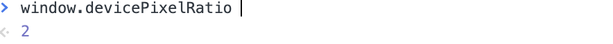

## 1. Text-level semantics

## `<br>`, `<wbr>`

디자인 적으로 줄바꿈을 하고 싶을 때 `<br>`을 사용합니다. 단순히 줄바꿈을 위한 기능적인 태그로 의미는 없습니다. <wbr>은 텍스트 박스에서 한 줄로 모두 표시가 안될 때에만 줄바꿈이 일어나게 하는 것입니다.

```html
<p>
  <!-- 공백병합 -->
  Lorem ipsum <br />
  <br />
  <br />
  dolor sit amet
</p>
<p>
  풀밭에 같지 전인 노년에게서 청춘의청춘의청춘의<wbr /> 방지. 전인 열락의 풀이
  것이다.
</p>
```

## `<a href="경로">`

`<a>` 요소는 HTML의 핵심적인 요소로써 하이퍼 텍스트 즉, 링크를 만들 때 사용합니다.

href 속성을 통해 경로를 지정할 수 있습니다. href 속성을 사용하지 않고 자바스크립트로 경로를 지정할 수도 있지만 이는 웹 접근성에 위배됨으로 href 속성을 사용해주는게 좋습니다.

html 문법상 sections, grouping content 요소들은 텍스트 레벨 요소의 자식으로 사용되지 않지만, 앵커 태그만 예외적으로 sections, grouping content 요소를 자식으로 하는것이 허용됩니다.

또한, `<a>` 요소안의 자식으로 `<a>` 요소나 `<button>` 과 같이 사용자와 인터렉션이 가능한 요소를 자식으로 두지 않습니다.

<aside>
💡 Internet Explorer 는 download 속성을 지원하지 않습니다.

</aside>

```html
<a href="https://www.naver.com">click</a>
<a href="https://www.naver.com" target="_blank">click</a>
<!-- 새창에서 실행해줌-->
<a href="./index.html">click</a>
<a href="#three">click</a>
<!-- 해쉬 링크, 목차처럼 이용할 수 있음 -->
<a href="./index.html" download>click</a>
<!-- 해당하는 컨텐츠 다운로드 할 수 있음 -->
<a href="./hello.hwp">hwp click</a>
<a href="./hello.hwp" download="a.hwp">hwp download click</a>
<!-- 속성 값을 넣어 줄 수 있음  -->
<a href="./hello.pdf">pdf click</a>
<a href="./hello.pdf" download="a.pdf">pdf download click</a>
```

→ `<a>`자식으로 `<a>`나 사용자와 인터렉센가능한 `<button>`은 자식으로 두지 않습니다.

## `<b>, <strong>`

`<b>` 태그는 굵은 글꼴을 표현하고 싶을 때 사용합니다. 별 다른 의미는 없으며 오직 텍스트를 굵은 글씨로 표현하기 위한 용도이기 때문에 더 이상 사용하지 않는 요소입니다. <strong> 태그는 굵은 글꼴에 중요도를 더해
강조할 때 사용합니다.

```html
<p>
  <strong>hello</strong>
  adipisicing <b>elit</b>.
</p>
```

## `<i>, <em>`

`<i>` 태그는 기울임 글꼴을 나타냅니다. HTML5에서는 전문 용어, 문단에서 주 언어와 다른 언어로 표현된 부분(주 언어가 한글이지만 영어로 표기되었을 경우), 소설이라면 등장인물의 생각이 표기되어 있는 부분 등 어떤 이유로 주위와 구분해야 하는 부분을 표현하기 위해 사용합니다.

`<em>` 태그는 같은 기울임 글꼴로 표현되지만 강조의 의미가 있습니다.

```html
<p>시장안은 사람들의 활기로 가득차 있었다.</p>
<p>
  상인 : 이 상품은 현재 <em>30%</em> 할인중입니다! 나 : 아하 그렇군요!
  <i> '흠.. 왜 하필 지금 할인하는걸까?!' </i> 좀 더 구경하고 올게요!
</p>
<p>나는 상인의 의도를 의심할 수 밖에 없었다.</p>
```

## `<dfn>`

현재 문맥에서 정의하고 있는 용어를 나타냅니다. dfn의 가장 가까운 부모가 <p> 혹은 <dt><dd> 쌍, <section> 요소일 경우 그 컨텐츠를 dfn의 정의에 대한 설명으로 간주합니다. 문서에서 최초로 나타났을 때 사용합니다.

```html
<dl>
  <dt>WWW</dt>
  <dd>
    <dfn>WWW</dfn>는 인터넷에 연결된 컴퓨터를 통해 사람들이 정보를 공유할 수
    있는 전 세계적인 정보 공간을 말한다. - 위키백과
  </dd>
</dl>
```

## `<abbr>`

<abbr> 태그는 준말, 약자를 나타내고 싶을 때 사용합니다. 보통은 홀로 쓰이고 dfn 태그로 으로 감싸주기도 합니다.

```html
<dl>
  <dt>WWW</dt>
  <dd>
    <dfn><abbr title="World Wide Web">WWW</abbr></dfn
    >는 인터넷에 연결된 컴퓨터를 통해 사람들이 정보를 공유할 수 있는 전 세계적인
    정보 공간을 말한다. - 위키백과
  </dd>
</dl>
```

## `<sup>, <sub>`

<sup> 태그는 윗첨자, <sub> 태그는 아랫첨자를 나타냅니다. 작은 글자를 표현하는 용도로는 사용하지 않으며 화학기호나 수학공식 등 첨자 기호를 이용해야 하는 곳에서만 사용합니다.

```html
<p>H<sub>2</sub>0</p>
<p>x<sup>2</sup>=4</p>
```

## `<span>`

- 별다른 의미 없이 보통 줄 바꿈 없이 영역을 묶는 용도로 사용합니다.
- 여러 요소를 묶어 컨트롤하기 위한 영역으로 id를 주거나 클래스를 사용하기도 합니다.
- div와 마찬가지로 최후 수단으로 사용하세요.

```html
...중략...
<style>
  #명언 {
    color: red;
  }
</style>
...중략...
<p>
  <span id="명언">제발 그만해.. 이러다 다~~ 죽어!</span>라고 오일남이
  소리쳤습니다.
</p>
<p></p>
```

## 2. Embedded content

## ``

`` 태그는 html 페이지에 이미지를 삽입할 때 사용하는 태그입니다.

### src (source)

`` 태그는 `src`라는 필수 속성이 있어야 합니다. `src` 속성은 브라우저에게 이미지 파일의 위치 및 파일명을 알려줍니다. 큰따옴표 안에 들어가는 경로는 절대경로이거나 상대경로이어야 합니다.

**절대경로**

절대경로는 표시하고 싶은 이미지의 위치 값을 그대로 가져오기만 하면 됩니다. 이미지가 저장되어 있는 폴더를 열고 '주소를 텍스트로 복사'하는 방법이 가장 간단한 방법입니다.

```html
<!-- OS X에서 절대 경로 지정한 경우 -->


<!-- 윈도우즈에서 절대 경로 지정한 경우 -->

```

**상대경로**

상대경로는 이미지를 표시할 HTML 문서의 위치를 기준으로 이미지 소스 파일의 위치를 인식하는 방식입니다. 상대경로를 지정하기 위해서는 다음의 기호들을 적절히 사용해주어야 합니다.

**/**  : ~에 있는

**.**  : 이미지를 표시할 HTML 문서의 위치

**..** : 상위 폴더

```html

또는

```

### alt (alternative text)

`alt` 속성은 이미지가 보이지 않을 때 `alt` 속성에 적힌 텍스트를 이미지 대신 보여줍니다. 또한 스크린리더와 같은 접근성을 위한 프로그램에 정보를 제공하기 위한 용도로 사용되며, 브라우저에 이미지에 대한 정보를 전달함으로써 SEO(Search Engine Optimization)에 도움을 주기도 합니다.

```html
 
<!-- alt값 필요 없을때는 빈칸으로 비워두기, 없애지 말것! -->

```

### **반응형 이미지를 위한 srcset**

`srcset` 속성을 사용하면 여러 해상도에 대응하여 브라우저가 최상의 이미지를 로딩하는데 도움을 줄 수 있습니다. `srcset` 속성은 다양한 크기를 가지는 동일 이미지를 최소 2개 이상 사용할 때 사용하며, 브라우저에게 이미지의 선택권을 위임하는 속성입니다. (이미지 중에 어떤 이미지가 브라우저에서 가장 잘보여질지 물어보는 것으로 생각하면 됩니다.)

### x서술자, w서술자, sizes 속성

- x서술자는 화소의 밀도(pixel density)를 나타냅니다. 디바이스의 화소 밀도에 따른 이미지를 로딩하도록 브라우저에 알려줍니다.

```html

```

<aside>
💡 Pixel density : 동일한 면적에 들어가는 화소의 수를 의미합니다. 화소의 갯수가 많을수록 더 높은 해상도의 기기임을 알 수 있습니다. 
여러분이 보고있는 화면의 화소 밀도를 알고 싶으시다면 브라우저 api를 이용해서 보실 수 있습니다. 개발자 화면의 콘솔창에서 `window.devicePixelRatio` 명령어를 입력해보세요.

</aside>



- w서술자는 원본 이미지의 넓이가 차례대로 300px, 600px, 700px 임을 브라우저에게 알려줍니다. px이 아닌 w로 표기하는것에 주의하세요. 내 기기의 성능(?) 에 따라 다르게 나오며, 높을수록 좋습니다.

```html

<!-- 셋 중에 하나 골라서 렌더링해줌!-->
```

<aside>
💡 w서술자와 x서술자는 동시에 사용할 수 없습니다. 또한 `src` 속성을 유지하는 것은 필수입니다. `srcset` 을 사용할 수 없는 브라우저(Internet Explorer)를 대비해 사용하는 이미지입니다.

</aside>

- `sizes` 속성은 뷰포트의 조건에 따라 이미지가 UI안에서 차지하게 될 사이즈를 브라우저에 알려줍니다.

```html

```

`(min-width: 960px) 250px` → 960px 보다 크면 250px로 지정

`(min-width: 620px) 150px` → 620px ~ 960px 이라면 150px로 지정

브라우저는 우리가 제공한 이미지의 원본 사이즈와 뷰포트에 따른 이미지의 사이즈 정보를 통합해 가장 적절한 이미지를 로딩하게됩니다.

물론 `srcset` 속성은 `sizes` 속성이 없다고 해도 잘 동작하겠지만, 웹표준을 준수하기 위해서는 `srcset` 속성을 사용하면 그에 맞는 `sizes` 속성도 반드시 명시되어야 합니다.

<aside>
💡 `sizes` 속성을 사용할 때 주의할 점은 CSS를 통한 이미지의 사이즈를 컨트롤 하는 방법과 충돌 할 수 있다는 점 입니다. (CSS 스타일이 `sizes` 속성에 우선합니다.) 협업할 때는 사전에 반드시 동료들에게 어떠한 방법으로 반응형 이미지를 처리했는지 공유합시다.

</aside>

```html
<!DOCTYPE html>
<html lang="en">
  <head>
    <meta charset="UTF-8" />
    <meta http-equiv="X-UA-Compatible" content="IE=edge" />
    <meta name="viewport" content="width=device-width, initial-scale=1.0" />
    <title>Document</title>
  </head>

  <body>
    <!--  -->

    
  </body>
</html>
```

CSS와 충돌하면 CSS가 우선합니다. 이미지만 써도 충분히 구현가능하며 실무에서 거으 사용하지 않습니다.

## `<picture>`

`<picture>` 요소는 `<source>` 요소와 `` 요소를 통해 각기 다른 디스플레이 혹은 디바이스에 따라 조건에 맞는 이미지를 보여주는 요소입니다. `` 요소의 `srcset` 이 화면에 따른 이미지의 크기를 조절한다면 `<picture>` 요소는 이미지 포맷 자체를 변경 할 수 있습니다.

```html
<picture>
  <source srcset="babies_large.jpeg" media="(min-width:960px)" />
  <source srcset="babies.jpeg" media="(min-width:620px)" />
  
</picture>
```

→ 조건에 맞는 이미지 `src`찾고 img태그에 넣어서 보여줍니다. (`` 필수적입니다.)

→ 조건에 맞는 이미지 보여줄 수 있습니다. ``는 이미지 사이즈 조절만 조건에 따라 다르게 설정할 수 있었지만 `<picture>` 은 여러가지 이미지를 제시하면 조건에 따라 브라우저에 보여줍니다.

### media 속성

위의 코드에서 `<source>` 요소 안의 `media` 속성을 볼 수 있습니다.

`<picture>` 요소는 `media` 속성의 값을 통해 조건에 알맞는 이미지를 찾게 됩니다. 조건에 맞는 `<source>` 요소 안의 `srcset` 속성 값을 찾아 `` 태그의 `src` 에 넣어 화면에 보여주게됩니다. 이러한 구조로 작동하기 때문에 `` 요소가 없다면 이미지가 화면에 나타나지 않는다는 점에 주의하세요.

`<picture>` 와 `<source>` 요소 자체는 이미지를 표현하지 않습니다.

### type 속성

이미지의 포맷 타입을 브라우저에게 알려줍니다.

```html
<picture>
  <source srcset="babies.webp" type="image/webp" />
  <source srcset="babies.avif" type="image/avif" />
  
</picture>
```

→ 예전 기술환경에서 작동하는 태그인 `` 는 지원하되, 최신 환경에서는 avif 등을 지원할 수 있습니다.

→ **위에서부터 차례대로 브라우저가 지원하는 포맷인지 탐색**하며 만약 지원하지 않는 포맷이라고 판단되면 다음 `<source>` 요소로 넘어갑니다. 만약 모든 `<source>` 요소의 이미지 사용이 불가능하면 최후에 `` 요소의 이미지를 랜더링 합니다. 때문에 **WebP나 AVIF 와 같은 최신 포맷의 이미지를 지원하고 싶다면** 크로스브라우징을 위해 `<picture>` 요소와 함께 사용 하는것이 좋습니다.

이러한 방식의 크로스브라우징 기법을 **`점진적 향상기법`**이라고 합니다.

<aside>
💡 **점진적 향상기법(중요)**
기본적으로 **예전 기술 환경에서 동작할 수 있는 기능을 구현해두고, 최신 기술을 사용할 수 있는 환경에서는 최신 기술을 제공**하여 더 나은 사용자 경험을 제공할 수 있는 방법입니다.

</aside>

<aside>
💡 **이미지 포맷의 종류 (중요)**  
**GIF**(Graphics Interchange Format) : 
256색의 컬러만 표현 가능하기 때문에 선명하진 않지만 용량이 적게 듭니다. 투명은 표현 가능하지만 그 정도를 조절하는건 불가능하며, 때문에 그림자 표현도 불가능합니다. 애니메이션 처리가 가능합니다.

**JPG/JPEG** (Joint Photographic Expert Group image):
매우 화소가 높고, 용량도 적지만 투명처리가 불가능합니다.

**PNG** (Portable Network Graphics) :
웬만한 컬러는 모두 표현 가능하여 투명 영역을 처리 가능하지만 용량이 큽니다.

**SVG** (Scalable Vector Graphics) :
SVG 형식의 벡터 이미지는 손실이나 품질 저하 없이 모든 크기에서 렌더링이 가능합니다.(이미지가 코드로 구현됨, 깨지지않음 but 복잡한 이미지는 용량이 매우커짐, 이모지 같이 간단한 이미지를 주로 표현 )

**WebP** (Web Picture Format) :
압축률이 좋다고 소문난 JPEG 이미지에 비해 무려 용량은 70% 수준으로 낮지만 더 뛰어난 색상을 지원하는 포맷입니다. 그럼에도 불구하고 PNG 처럼 투명도 표현 가능하며, GIF 처럼 애니메이션 표현도 가능한 만능 포맷입니다.

**AVIF** (AV1 Image File Format) : WebP 처럼 뛰어난 색상표현, 애니메이션 지원, 투명도 표현 모두 가능하며 JPEG 이미지의 50% 수준인 용량을 자랑하는 차세대 이미지 포맷입니다. 아직 지원하지 않는 브라우저가 많음에 주의해야합니다.

</aside>
