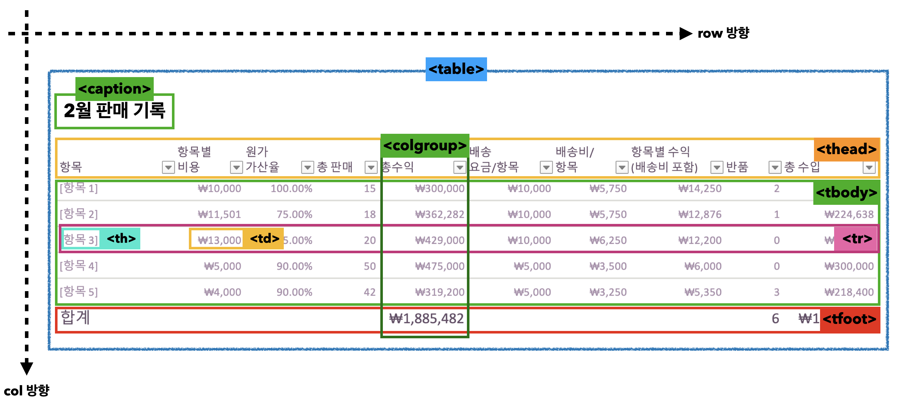
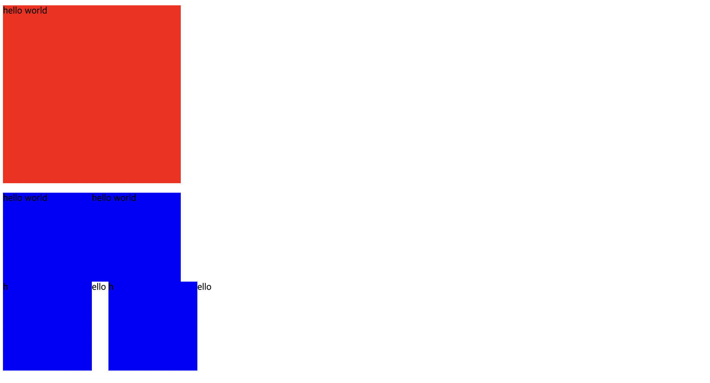
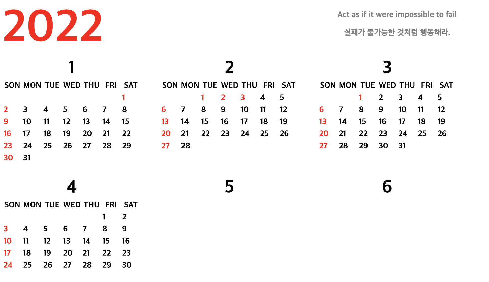

## 📌 `table`

> 내부에는 제목(caption)과 행(tr), 열(col) 그리고 셀(td)과 셀의 제목(th) 역할을 하는 여러 요소들이 자식으로 사용

🧷 table의 마크업 구조도 <br>


## 📌 `tr`, `th`, `td`

🧷 `tr` 태그는 테이블의 행을 나눌 때 사용 (tr-> 가로줄)
🧷 `td` 태그는 `tr` 태그로 나눈 행에서 셀을 분리할 때 사용(td->세로줄)
🧷 `th` 태그는 행, 열의 머리말을 나타내는 데 사용 + 글씨를 굵게, 가운데 정렬,

```html
<table>
  <caption>
    이달의 책 판매량
  </caption>
  <tr>
    <th>구분</th>
    <th>이름</th>
    <th>판매량</th>
  </tr>
  <tr>
    <td>1</td>
    <td>해리포터</td>
    <td>100</td>
  </tr>
</table>
```

## 📌 `colgroup`, `col`

🧷 `colgroup`과 그 자식 요소로 쓰이는 `col` 요소를 통해 한 열에 공통적인 스타일을 주는것도 가능 <br>

```html
<colgroup>
  <col style="width:200px;" />
  <col />
  <col />
  <col />
</colgroup>
```

# CSS

## 블록 요소와 인라인 요소

🧷 블록 -> ex) p → 백그라운드 컬러 → 부모의 너비 100%

🧷 인라인 -> ex) span → 텍스트 만큼 너비를 차지한다. → width 로 늘려도 적용안됨! → 높이와 너비를 조종할 수 없다!

🧷 block에서 inline의 옆으로 붙는 속성만 유지하고 싶다면 → inline-block

🧷 inline요소 사이의 여백 지우기



```html
<div class="one">
        <span>hello world</span>
        <span>hello world</span>
    </div>
    <div class="three">
        <span class="two">h</span>ello
        <span class="two">h</span>ello
    </div>
```

-> `font-size`에 따라 `font`의 여백이 달라짐 → `padding`, `margin`을 조정한다고 바뀌는 게 아님
<br>

## 다중스타일시트

> CSS 파일 안에 CSS 포함하기

```html
@import "foo.css";
```

## 📌 유용한 정보

🧷 html validator → 마크업이 잘 적용됐는지 확인 하는 법
→ 적어도 웹표준 문법적으로 문제는 없다. (최소한의 안전장치)

🧷 `caption` 연달아 사용X → 2개 필요하면 `caption`안에 에 P태그 사용 → 그래야 순서대로 진행됨

🧷 하나의 행을 만들때는 반드시 `tr`로! `tbody`는 하나만!

<br>

##  📌 과제
