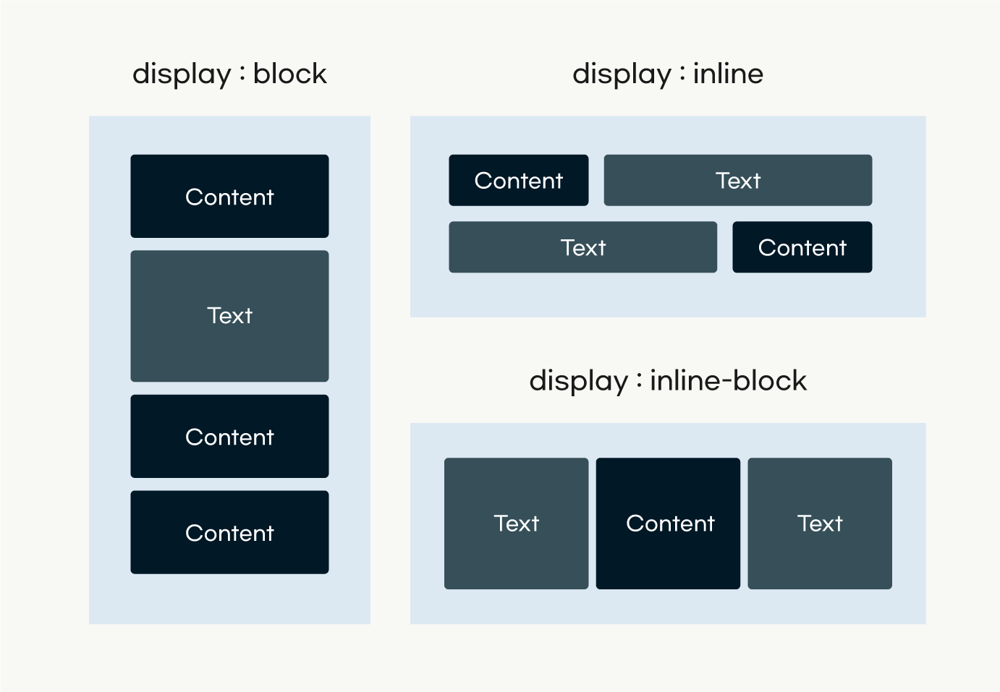
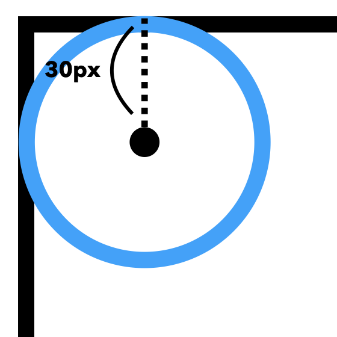
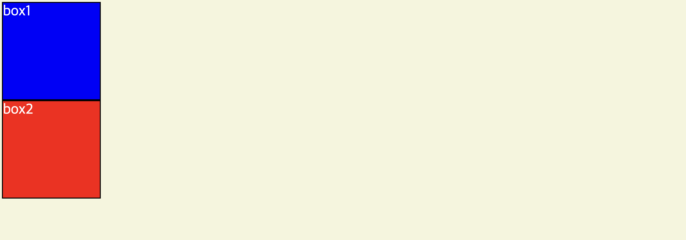
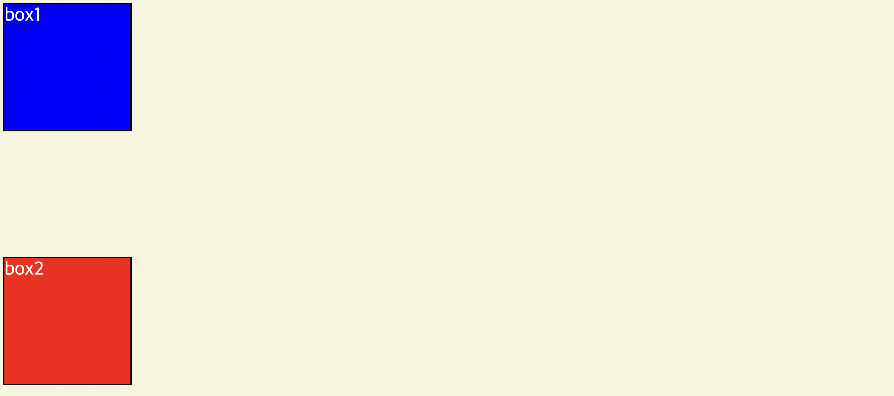
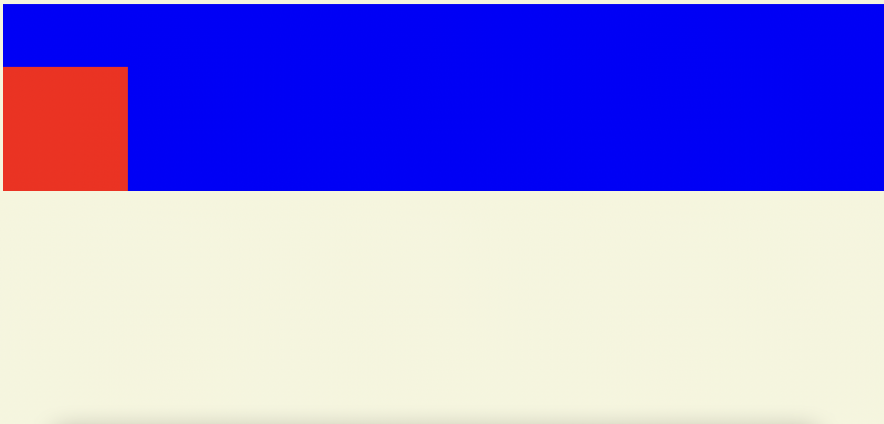
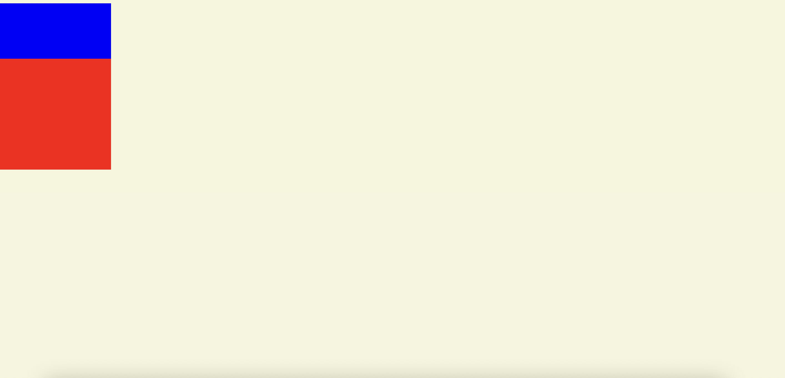
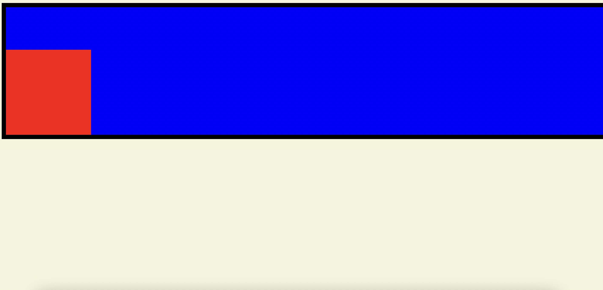
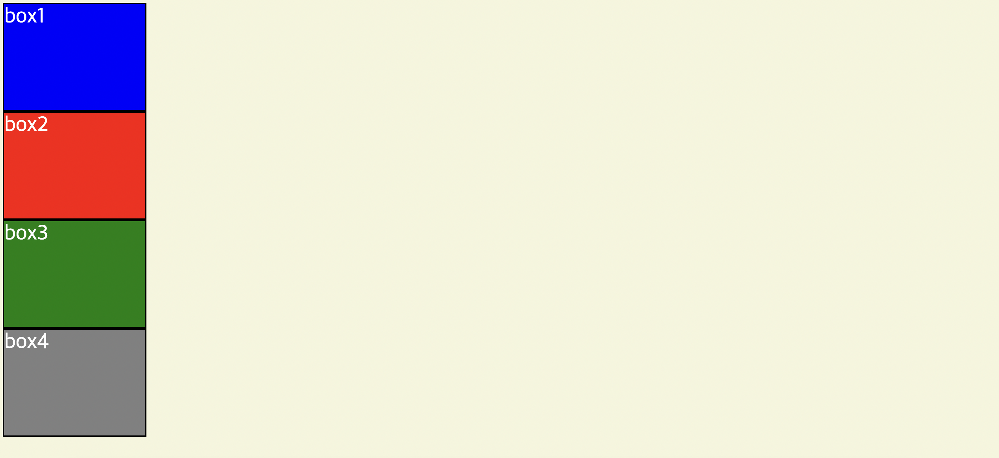
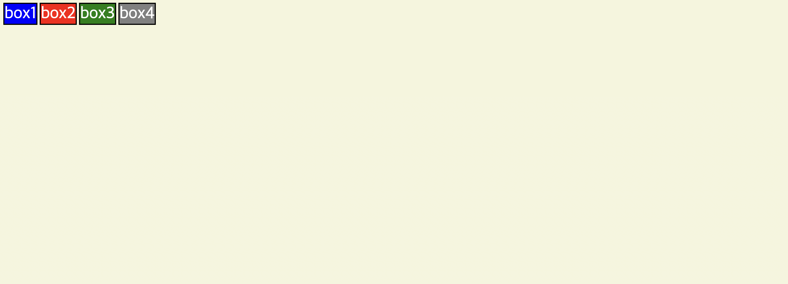
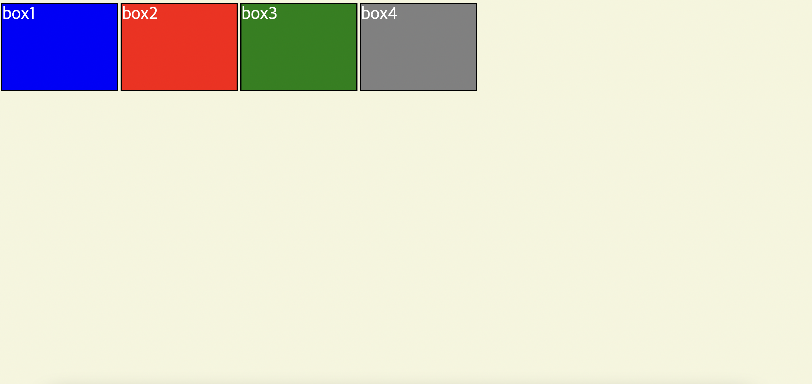

# CSS 박스모델

## 📌 블록 박스

- 사용 가능한 공간을 양 옆으로 100% 사용하며 사용하지 못하는 공간은 마진 영역으로 채운다. 상위 콘테이너에서 사용 가능한 공간을 채운다.
- width와 height속성을 사용하여 스타일을 컨트롤 할 수 있다.
- 패딩과 마진, 보더 속성을 사용하여 스타일을 컨트롤 할 수 있으며 해당 속성들이 다른 요소들을 밀어낸다.
  <br>

## 📌 인라인 박스

- 기본적으로 컨텐츠 박스만큼의 크기만 가진다.
- width와 hegiht속성을 사용할 수 없다.
- 패딩과 보더 속성을 사용할 수 있지만 마진 속성은 좌우만 조절할 수 있다. 해당 속성들의 상하 값(top, bottom)들은 다른 요소들을 밀어내지 않는다. <br>

## 📌 박스의 유형을 결정하는 속성 : `display`



<br>

### 📌 radius

```css
h1 {
  border: 3px solid #228b22;
  border-radius: 30px;
}
```



- 곡선부분의 가로나 세로 길이 만큼 px로 나타탬
- 50% 값을 주게되면 요소 넓이의 절반만큼 반지름을 가지는 원을 그리기 때문에 원을 그릴 수 있다.
- 한 꼭짓점만 둥글게 만들 수도 있다. (캐릭터 디자인에 용이함)

```css
h1 {
  width: 100px;
  height: 100px;
  border: 3px solid #228b22;
  border-radius: 50%;
}
```

## margin 겹침 현상

> 1. 요소와 요소의 사이에 `margin-top` 혹은 `margin-bottom`의 공간이 있을 경우 더 높은 값의 마진 값이 적용되는 현상(상하단만 적용됨)
>
> 2. 부모 요소와 자식 요소가 존재할 때, 자식 요소의 마진 탑 혹은 마진 바텀 값이 부모의 높이에 영향을 미치지 않는 현상

<br>

### 💡 margin 겹침 현상 해결 방법

1. 부모 요소에 `overflow: hidden;` 적용 → 흘러나오는 걸 잘라내기 때문에 자식요소의 마진 패딩값 인식함!

2. 부모 요소에 `display: inline-block` 값을 적용 → 자식요소의 너비를 인식할 수 있음 → 마진과 패딩을 인식

3. 부모 요소에 border 값을 적용

👉 각 방식의 장단점이 존재하기 때문에 상황에 맞는 방법을 이용하는 것이 좋다.

<br>

## 📌 margin 겹침 현상 예시

🧷 요소와 요소의 사이에 `margin-top` 혹은 `margin-bottom`의 공간이 있을 경우 더 높은 값의 `margin` 값이 적용되는 경우

box1에 `margin-bottom`, box2에 `margin-top` 적용



```css
.box1 {
  background-color: blue;
  margin-bottom: 100px;
}

.box2 {
  background-color: red;
  margin-top: 200px;
}
```

margin이 100px + 200px = 300px 이 아닌 더 큰 값인 200px이 적용됨



<br>

🧷 부모 요소와 자식 요소가 존재할 때, 자식 요소의 마진 탑 혹은 마진 바텀 값이 부모의 높이에 영향을 미치지 않는 경우

<br>

→ 자식 요소(빨강)에 `margin-top: 100px;` 을 적용해도 `margin`이 발생하지 않는다.

```css
.parent {
  background-color: blue;
}

.child {
  width: 200px;
  height: 200px;
  margin-top: 100px;
  background-color: red;
}
```

<br>

💡 해결방법

1.부모 요소에 `overflow: hidden;` 적용



<br>
2. 부모 요소에 `display: inline-block` 값을 적용

```css
.parent {
  background-color: blue;
  display: inline-block;
}
```



<br>

3. 부모 요소에 border 값을 적용



```css
.parent {
  background-color: blue;
  border: 10px solid black;
}
```

<br>

→ 1, 2 ,3 번 모두 부모와 자식사이에 `margin-top`을 줄 수 있게 해결하는 공통점을 가지지만 부모 요소에 `display: inline-block;` 을 이용한 경우 부모요소 너비가 자식요소만큼 줄어든다는 점을 유의하자!
<br>

## 📌 과제 2 인라인요소, 블록레벨 요소 활용예시

1. display: block



<br>

2. display: inline



3. display: inline-block



<br>

👉 `inline`은 텍스트만큼만 너비를 차지한다.(width와 height를 지정해도 무시된다.) 하지만, `inline-block`은 가로 배치가 가능하다는 점에서는 `inline`과 유사하지만 `width`와 `height` 값을 지정할 수 있다는 점에서 차이를 보인다.
