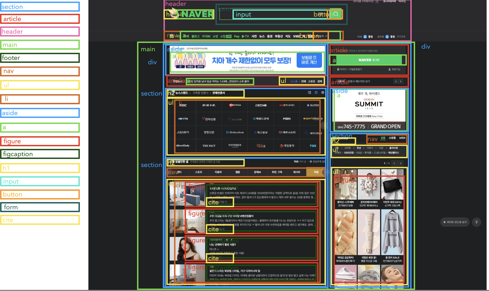
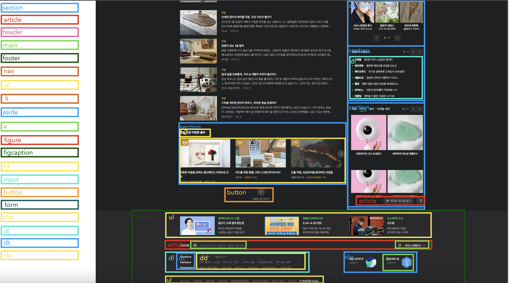

## 📌 HTML 레이아웃

🧷 `footer` → 보통 회사 내용이니까 제품정보도 footer에 포함하는게 좋다.

🧷 위젯 아이콘  →`article` 태그로 사용 가능하다! ex) 로그인 아이콘 (다른 페이지에 재활용이 가능하기 때문에) 

🧷 `address`태그 → 페이지 주체에 컨택하는 법 → 대표명, 대표주소등이 포함된다.

🧷 주제별로 `section` 태그 설정해야한다.
 

## 📌 HTML 레이아웃 적용 예시

 

 

## 📌 `label`

  `label` 태그를 통해 시각 장애인들도 폼을 사용할 수 있는 시멘틱한  요소를 만들 수 있다.

🧷 **`input` 태그에는 반드시 `label` 태그 넣어 줘야한다!**

🧷 **`label`의 `For`과 `form` 컨트롤의 `id`가 같은 값으로 연결되어 있어야 한다!!**

🧷 `form` 컨트롤 → `input`, `select`, `textarea` ..
 

## 📌 select

>여러가지 option중 하나를 선택할 수 있는 드롭다운 리스트 박스를 생성한다.

🧷 value : 선택값에 따라 서버에 어떠한 값을 전송할지 설정할 수 있다.