## 📌 vmin & vmax
> `vh`와 `vw`이 늘 뷰포트의 너비값과 높이값에 상대적인 영향을 받는다면 `vmin`과 `vmax`는 너비값과 높이값에 따라 최대, 최소값을 지정할 수 있다.

👉 ex) 브라우저의 크기가 1100px 너비, 그리고 700px 높이일때 `1vmin`은 7px이 되고 `1vmax`는 11px이 된다.

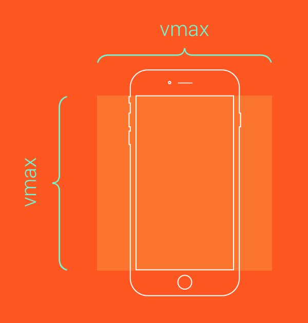

<br>

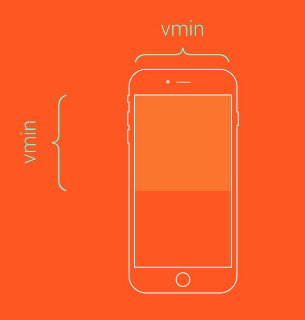

<br>

## 📌 2.overflow (과제1)

> 요소의 콘텐츠가 너무 커다랄 경우 요소를 어떻게 처리할지 지정한다.
> `visible(기본)`, `scroll`, `hidden`

`hidden`은 콘텐츠를 요소 크기만큼 잘라낸다. (`hidden` 적용한 요소 밖은 못나간다고 생각하자)

overflow : hidden vs display:none 차이

```css
.box1 {
  width: 300px;
  height: 300px;
  background-color: blue;
  margin: 200px auto;
  border-radius: 30px;
}
.box2 {
  width: 400px;
  height: 200px;
  background-color: red;
}
```

<br>
부모 요소인 box1(파랑)안에 자식요소 box2(빨강)이며, 부모의 width를 초과한 그대로 표현된다. 
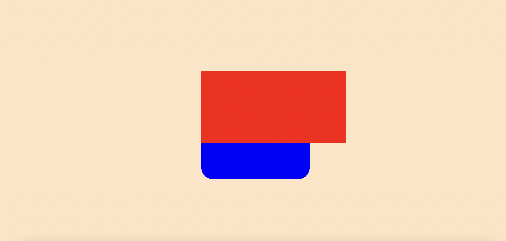

<br>

→ 부모요소인 box1(파랑)에 `overflow: hidden;` 추가시
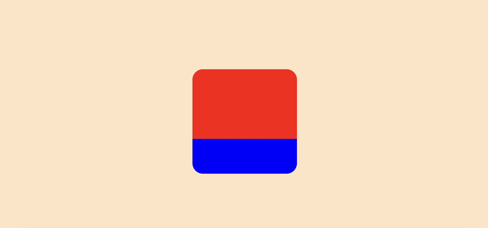
부모 요소인 box1 밖으로 자식 요소인 box2가 나가는 것을 막는 다는 것을 알 수 있다. (심지어 border-radius 처리된 부분까지도.. ) <br>

→ box1에 `overflow: hidden;` 대신 `display: none;` 추가시
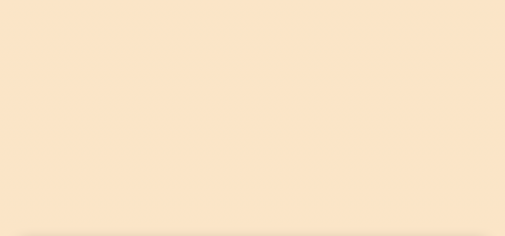

→ display: none; 은 부모요소 밖으로 나간 부분만 없애 주는게 아니라 부모요소를 포함한 모든 하위 요소까지 보이지 않게 만든다.

## 📌 background

`background` 속성 종류

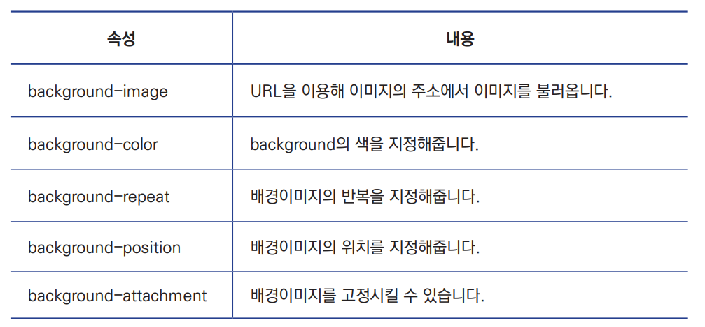 <br>


📎 가장 많이 사용하는 `background` 속성은 `background-size: cover;`이다.
‼️ but, `background-position: center;`를 함께 사용해야 이미지 비율이 깨지지 않는다

ex)

```css
.four {
  background-position: center;
  background-size: cover;
}
.five {
  background-size: cover;
}
```

-> class `four` 처럼 css를 적용해야 이미지 비율이 깨지지 않는다.
<br>

어느 곳에서 `img` 태그를, 어느곳에서 `background-image`를 사용할까?

👉 주로 백엔드 개발자와 협업해야 하는 공간에는 img 태그, FE 혼자 작업하는 공간에는 `background-image`를 사용합니다.

## 📌 line-height

> 글자의 높이를 지정
> number : 1은 `font-size`만큼, 2는 2배
> px, em : 단위만큼 높이 설정됨

‼️ line-height → px,em값으로 잡으면 안됨! → 다닥다닥 붙어 나옴

‼️ 그냥 마진 패딩 지우면 여전히 폰트 여백이 있음(leading영역) -> `line-height: 1` 적용해야함  
ex) h1 → 높이 42.4가 나옴! 폰트, 폰트 사이즈에 따라서도 다르게 나옴!

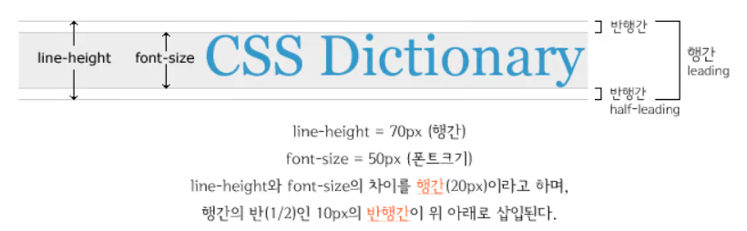

<br>


## 📌 중앙 정렬 (과제2)

1. position, transform 사용
2. Flex 사용
3. margin: auto; 사용
4. Grid와 place-content 사용 <br>

🧷 position, transform 사용 

```css

      .box1 {
        width: 400px;
        height: 400px;
        background-color: blue;
        margin: 200px auto;
        position: relative;
      }
      .box2 {
        width: 200px;
        height: 200px;
        background-color: red;
      }
```

부모 요소에 `position:relative` 자식 요소에 `position:absolute` 적용

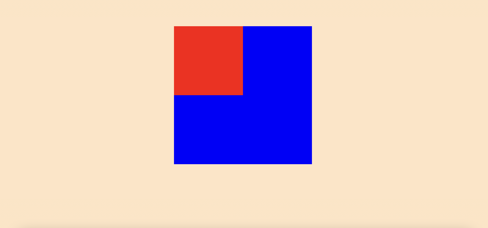

<br>

자식 요소에 `left: 50%` `top: 50%` 적용 (자식요소의 좌측 상단이 부모요소의 정중앙에 위치)

`left: 50%` → 부모 요소의 절반 만큼 우측으로 이동 (좌측 상단 꼭지점 기준)

`top: 50%` → 부모 요소의 절반만큼 아래로 이동(좌측 상단 꼭지점 기준)


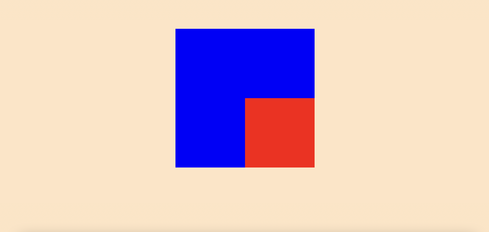

<br>

자식 요소에 `transform: translate(-50%, -50%)` 적용

→ 자식요소 너비의 절반만큼 좌측으로 이동, 높이의 절반 만큼 위로 이동 

→ 부모 요소 안에서 중앙 정렬

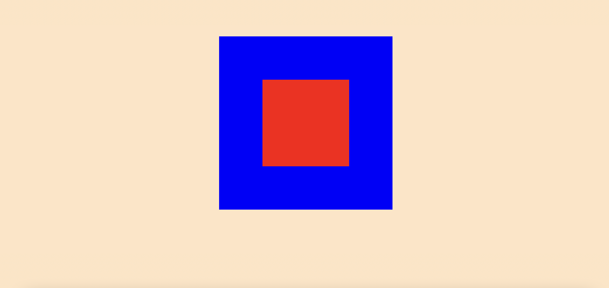

```css
.box1 {
        width: 400px;
        height: 400px;
        background-color: blue;
        margin: 200px auto;
        position: relative;
      }
      .box2 {
        width: 200px;
        height: 200px;
        background-color: red;
        position: absolute;
        left: 50%;
        top: 50%;
        transform: translate(-50%, -50%)
      }
```
<br>

🧷 flex 사용

부모 요소에 `display: flex;` `justify-content: center;` `align-items: center;` 적용


```css
.box1 {
        width: 400px;
        height: 400px;
        background-color: blue;
        margin: 200px auto;
        display: flex;
        justify-content: center;
        align-items: center;
      }
      .box2 {
        width: 200px;
        height: 200px;
        background-color: red;
      }
```

<br>

🧷 자식 요소에 `margin: auto`

메인 콘텐츠 컨테이너를 수평 중앙에 둘 때 사용 → 좌우 여백이 최대폭을 기준으로 반반씩 정확히 가져가게 할 수 있다.

but, display가 inline, inline-block이면 제대로 작동하지 않는다.

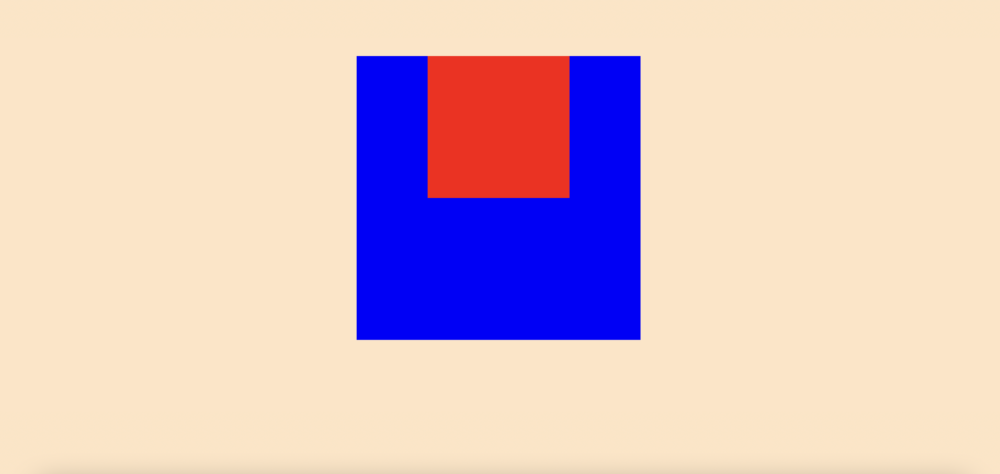

<br>

🧷 Grid와 place-content 사용
부모 요소에 `display: grid` `place-content: center` 적용

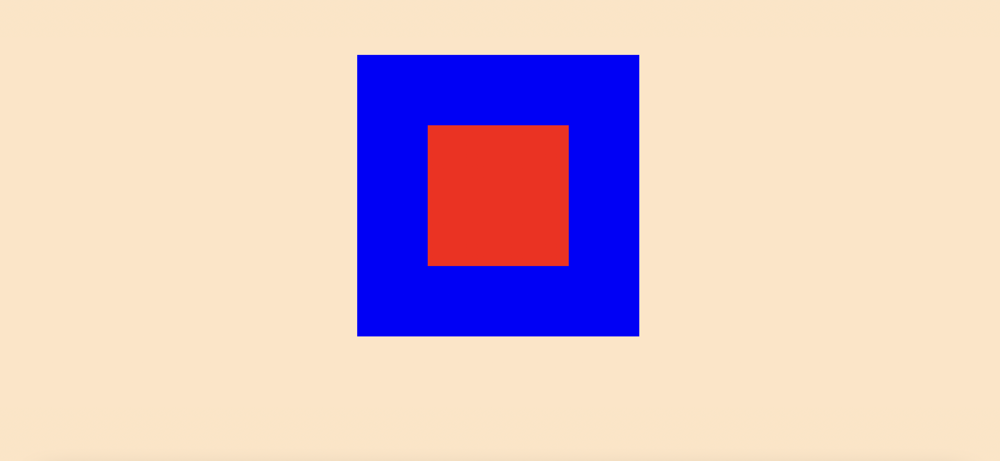 <br>


```css
.box1 {
        width: 400px;
        height: 400px;
        background-color: blue;
        margin: 200px auto;
        display: grid;
        place-content: center;
      }

      .box2 {
        width: 200px;
        height: 200px;
        background-color: red;
      }
```