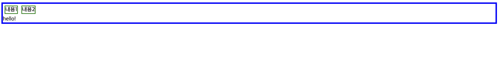
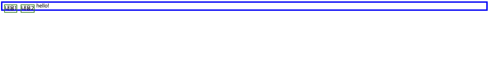

## 📌 float 속성의 문제점

전체를 감싸는 컨테이너가 자식 요소들이 모두 float 속성을 가질 때 자식 요소들의 높이를 반영하지 못하고 자신의 높이만큼만 보여준다.

→ 부모요소가 float처리된 자식요소를 알아보지 못한다.

### 🧷 why?

position(absolute, fixed) 의 방법을 사용하면 normal flow 에서 벗어나게 된다. normal flow에 속한 요소들은 normal flow에서 벗어난 float, position 속성이 적용된 요소들을 인식하지 못한다.

### 🧷 해결방법

clear 속성을 사용

::after 가상요소로 해결한다. 부모 요소에 가상으로 마지막 child 요소를 덧붙여서 부모 요소인 wrap이 자식 요소들을 알아보게 하는 방법이다.
-> 부모 요소와 이후에 float요소를 따라오는 현상까지 모두 다 해결된다.

형제가 옆에있는 형제를 알아볼 때 사용한다.

```css
<!DOCTYPE html>
<html>
  <head>
    <style>
      .wrap {
        border: 4px solid blue;
      }

      .wrap::after {
        content: "hello!";
        display: block;
          clear: both;
      }

      .content {
        float: left;
        margin: 5px;
        height: 20px;
        border: 2px solid green;
      }
    </style>
  </head>

  <body>
    <div class="wrap">
      <div class="content content2">내용1</div>
      <div class="content">내용2</div>
    </div>
  </body>
</html>
```



```css
.wrap::after {
  content: "hello!";
  display: block;
  clear: both;
}
```

clear: both 나 display: block을 없애면 → 자식요소를 인식하지 못함



‼️ 인라인 → vertical-align 사용가능 → float은 사용 불가 → float쓰고 margin-top쓰면 세로 중앙 정렬이 가능함
