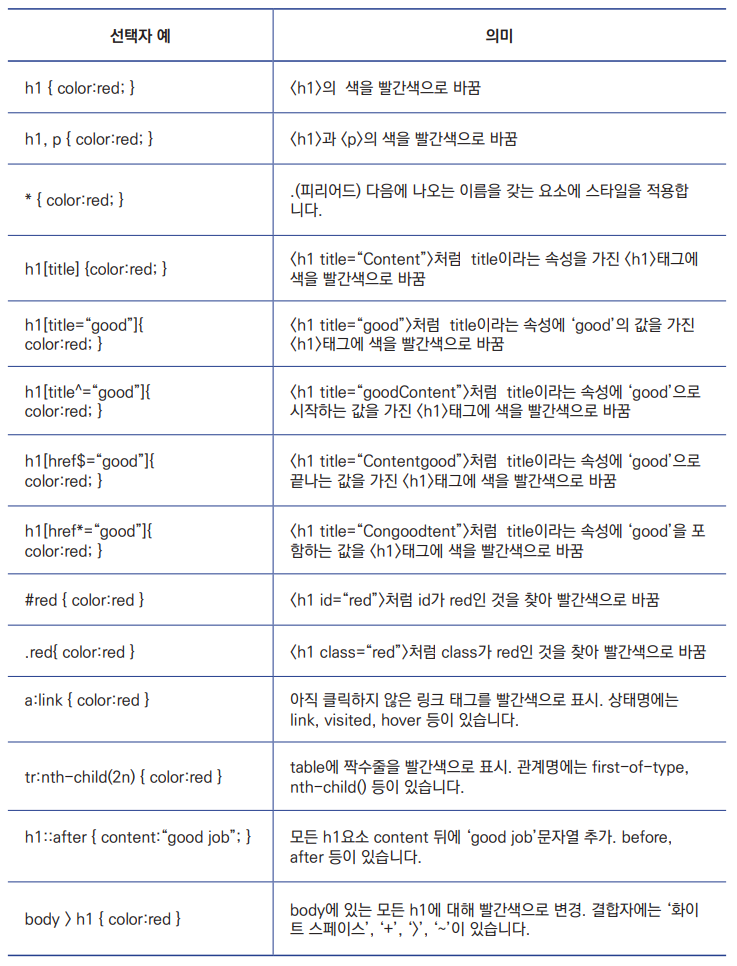
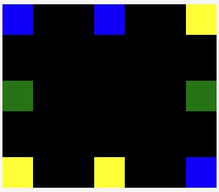

## 📌 1. 속성선택자



`body > h1` 은 자식요소만 해당!! <br>

## 2. 가상 클래스 선택자(Pseudo class selector)

`a:hover { }` `p:nth-child(1)` 와 같이 실재로 html에 존재하지 않는 클래스지만 마치 클래스가 존재하는것 처럼 작동한다고 하여 가상 클래스 선택자로 부른다.

`.foo:first-child :` class="foo"인 엘리먼트 중 첫번째 자식인 엘리먼트를 선택

`.foo:last-child :` class="foo"인 엘리먼트 중 마지막 자식인 엘리먼트를 선택

`.foo:nth-child(n):`class="foo"인 엘리먼트 중 n번째 자식인 엘리먼트를 선택 <br>

### 📌 2.1 상호 작용을 위한 가상클래스

### :hover

사용자가 마우스를 요소 위에 올렸을 때 적용 <br>

### :active

사용자가 요소를 실행할 때(버튼을 누르거나 링크를 클릭할 때) 적용 <br>

### :focus

요소에 포커스가 있을 때 적용 -> 클릭할 수 있는 요소나 폼컨트롤(input, select 등등)과 같이 상호작용 할 수 있는 모든 요소에는 포커스가 가능 <br>

## 3. 가상 요소 선택자

🧷 가상 요소 → 하나의 요소처럼 작동을 한다 ex) `::after`

🧷 가상 요소 선택자는 마크업 없는 요소를 삽입(가상 클래스 선택자는 클래스 없는 요소에 클래스 삽입)

🧷 가장 많이 사용하는 가상 요소 선택자는 `after` 와 `before`

‼️ 1부터 시작한다.. 익숙지 않다. ex) `.foo:nth:child(1) {}`

<br>

<details>
<summary>가상 요소 선택자 예시코드</summary>
<div markdown="1">

```html
<!DOCTYPE html>
<html lang="ko">
  <head>
    <title>가상 요소 선택자</title>
    <style>
      p::after {
        content: "cm";
      }
      p::before {
        content: "!!";
      }
    </style>
  </head>
  <body>
    <p>10</p>
  </body>
</html>
```

</div>
</details>

# flex

> 컨텐츠를 정렬하거나 공간을 나눌 수 있는 CSS 속성의 집합

‼️ 이정도만 확실히!

```css
align-items: center;

justify-content: center;
```



<details>
<summary> flex 실습코드</summary>
<div markdown="1">

```html
<!DOCTYPE html>
<html lang="ko">
  <head>
    <meta charset="UTF-8" />
    <meta http-equiv="X-UA-Compatible" content="IE=edge" />
    <meta name="viewport" content="width=device-width, initial-scale=1.0" />
    <title></title>
    <style>
      article {
        background-color: black;
        width: 600px;
        height: 600px;
        display: flex;
        justify-content: space-between;
        margin: auto;
      }

      .blue {
        background-color: blue;
      }

      .green {
        background-color: green;
      }

      .yellow {
        background-color: yellow;
      }

      .left_side {
        display: flex;
        justify-content: space-between;
        flex-direction: column;
      }

      .right_side {
        display: flex;
        justify-content: space-between;
        flex-direction: column-reverse;
      }

      .center {
        display: flex;
        justify-content: space-between;
        flex-direction: column;
      }

      .left_side div {
        width: 70px;
        height: 70px;
      }

      .center div {
        width: 70px;
        height: 70px;
      }

      .right_side div {
        width: 70px;
        height: 70px;
      }
    </style>
  </head>
  <body>
    <article>
      <div class="left_side">
        <div class="blue"></div>
        <div class="green"></div>
        <div class="yellow"></div>
      </div>
      <div class="center">
        <div class="blue"></div>
        <div class="yellow"></div>
      </div>
      <div class="right_side">
        <div class="blue"></div>
        <div class="green"></div>
        <div class="yellow"></div>
      </div>
    </article>
  </body>
</html>
```

</div>
</details>

<br>

## 📌 유용한 팁

✔️ 포폴 리드미 작성 양식 : https://github.com/paullabkorea/resume-repo <br>
✔️ flex 연습 사이트 https://codepen.io/enxaneta/full/adLPwv
