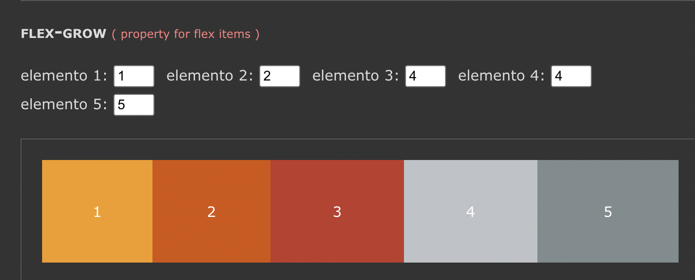
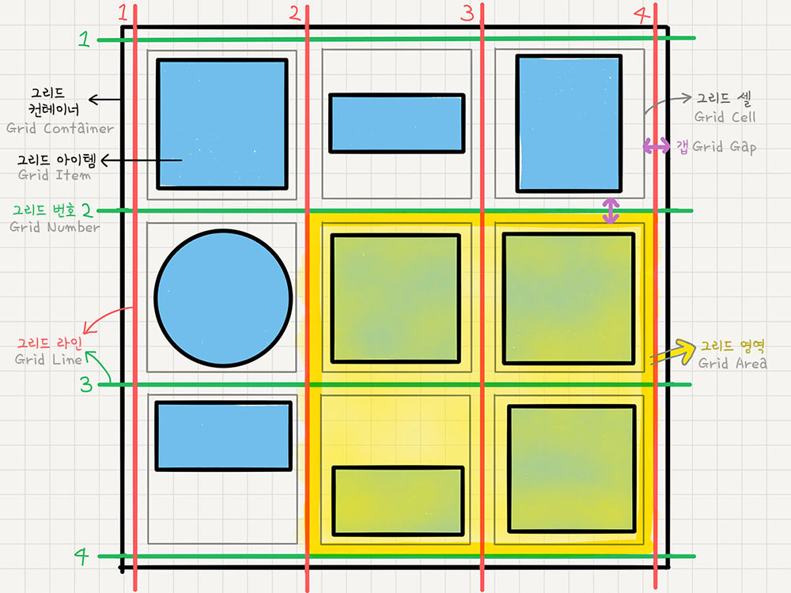
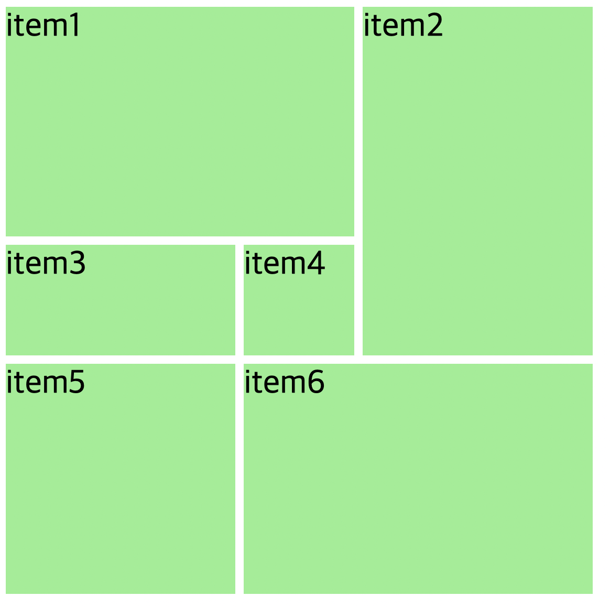

## 📌 flex-basis

> flex item 들의 크기를 지정한다. 기본값은 auto. auto일 때는 width, height 값을 사용한다.

‼️ flex-basis 값이 적용되어 있다면 width, height 값은 무시된다.

→ flex 아이템의 초기 크기라고 생각하자
→ 자식요소에 사용! <br>

## 📌 flex-grow

> flex-basis의 값에서 더 늘어나도 되는지 지정하는 값이다.

flex-grow  : 1 → 자식 요소들이 모두 동일한 크기의 공간을 할당받음

flex-grow  : 2 →  다른 자식요소보다 두배의 공간을 할당받음. ( 자식요소들의 컨텐츠 크기가 존재한다면 그 컨텐츠의 넓이에 따라 할당받는 값이 달라진다.) <br>

→ 자식요소에 사용! <br>



<br>
## 📌 flex-shrink

> flex-grow에 반대되는 개념으로 flex-basis의 값에서 더 줄어들어도 되는지 지정하는 값이다.

→ 0의 값을 사용할 경우 컨테이너의 크기가 줄어도 값은 고정된다.

‼️ 부모에 flex-wrap: wrap; 속성이 있는 경우 적용되지 않는다.

→ 축약형

```css
/* flex-grow:1; flex-shrink:1; flex-basis:300px; */
flex: 1 1 300px;
```
<br> 

# 📌 grid
> display:grid;로 그리드 컨테이너와 아이템을 설정합니다.
 <br>
 


### template

`grid-template-columns` : 열의 넓이를 설정

`grid-template-rows` : 행의 높이를 설정

`repeat`( 적용할 트랙의 갯수, 반복할 수치 ) 함수를 이용하면 그리드 트랙 별 수치 반복을 설정 할 수 있습니다.

‼️ `grid-auto-rows: minmax(300px, auto)` → 컨텐츠가 그리드 셀을 넘어가는 것을 막을 수 있음(overflow 사용하지X) → 몇개가 있든 다 300px로 맞춰준다 overflow 사용하지X) → 몇개가 있든 다 300px로 맞춰준다.

<details>
<summary>grid-template 예시코드</summary>
<div markdown="1">

```css
<!DOCTYPE html>
<html lang="ko">
  <head>
    <meta charset="UTF-8" />
    <meta http-equiv="X-UA-Compatible" content="IE=edge" />
    <meta name="viewport" content="width=device-width, initial-scale=1.0" />
    <title></title>
    <style>
      .container {
        display: grid;
        height: 100vh;
        /* grid-template-columns: 50% 25% 25%; */
         grid-template-columns: 25% 25% 25% 25%;
        /* grid-template-columns: repeat(3, 1fr) */
        /* grid-template-columns: repeat(4, 25%); */
        /* grid-template-columns: 100px 30% 30%; */
        /* grid-template-columns: 100px 1fr 1fr; */
        gap: 10px 20px;
        grid-template-rows: 100px 200px 100px;
      }

      .item {
        background-color: pink;
        border: solid 1px black;
      }
    </style>
  </head>
  <body>
    <div class="container">
      <div class="item">1</div>
      <div class="item">2</div>
      <div class="item">3</div>
      <div class="item">4</div>
      <div class="item">5</div>
      <div class="item">6</div>
      <div class="item">7</div>
    </div>
  </body>
</html>
```

</div>
</details> <br>

## 각 셀의 영역 지정
ex)
grid-column: 4 / 6; (4번째 열부터 5번째 열까지 가로로 2칸 병합해라)
grid-row: 1 / 4; (첫번째 행부터 3번째행까지 세로로 3칸 병합하라)

	<br>
‼️ 큰 덩어리 요소 개수만큼만 생성하자 (table처럼 많이 생성할 필요가 없다)
<details>
<summary>grid 셀병합 실습코드</summary>
<div markdown="1">

```css
<!DOCTYPE html>
<html lang="ko">
  <head>
    <link rel="stylesheet" href="reset.css" />
    <style>
      .container {
        display: grid;
        height: 700px;
        width: 700px;
        grid-template-columns: repeat(5, 1fr);
        grid-template-rows: repeat(5, 1fr);
        grid-gap: 10px;
      }
      .container div {
        background-color: lightgreen;
        font-size: 40px;
      }

      img {
        width: 100%;
        height: 100%;
      }

      .item1 {
        grid-column: 1 / 4;
        grid-row: 1 / 3;
      }

      .item2 {
        grid-column: 4 / 6;
        grid-row: 1 / 4;
      }

      .item3 {
        grid-column: 1/3;
      }

      .item5 {
        grid-column: 1/3;
        grid-row: 4/6;
      }

      .item6 {
        grid-column: 3/6;
        grid-row: 4/6;
      }
    </style>
  </head>
  <body>
    <div class="container">
      <div class="item1">item1</div>
      <div class="item2">item2</div>
      <div class="item3">item3</div>
      <div class="item4">item4</div>
      <div class="item5">item5</div>
      <div class="item6">item6</div>
    </div>
  </body>
</html>
```
</div>
<details>


