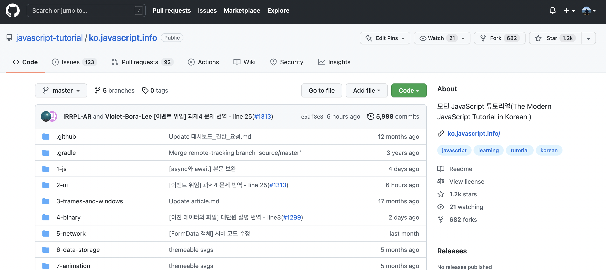
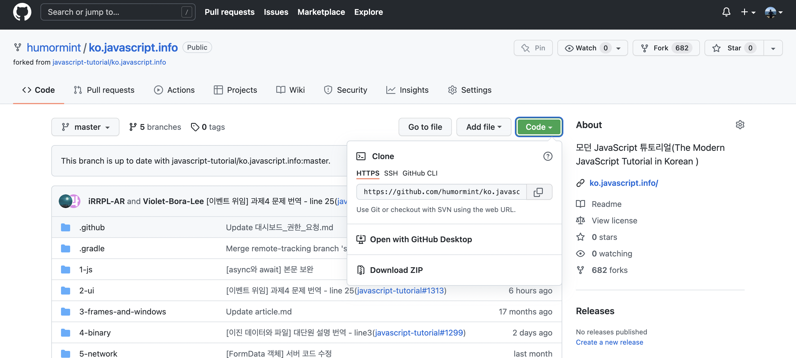
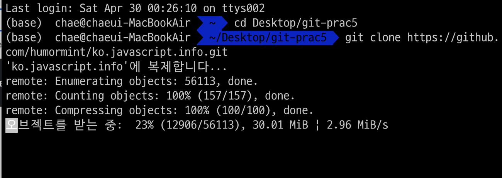
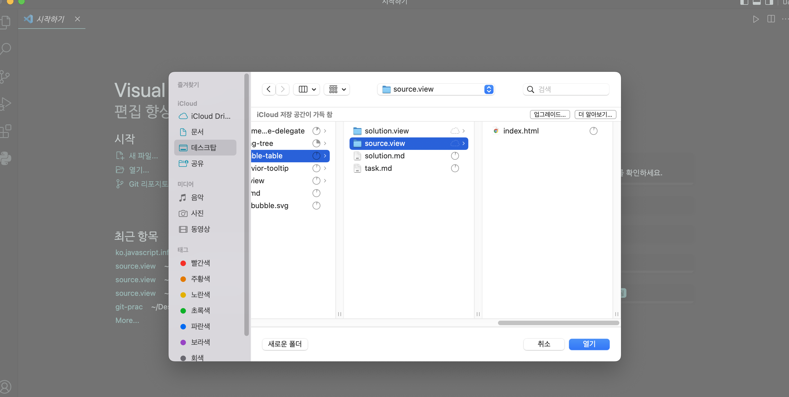
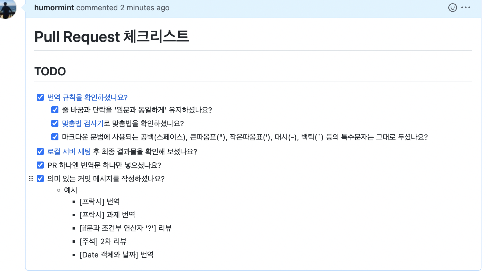
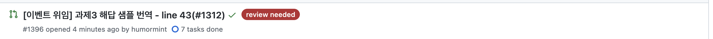

## 오픈소스 기여하기

 

보라님 레파지토리 → `folk`

 

 

folk 된 저장소 url 복사

해당 폴더에 접근해서 `git clone [url]`

‼️ 여기서 git init 하지말것

 

작업할 폴더 VS Code로 열기

 

1.  `git branch docs/1312`
2.  `git branch`
3.  `git checkout docs/1312`
4.  `index.html` 작업
5.  `git add index.html`
6.  `git commit -m "[이벤트 위임] 과제3 해답 샘플 번역 - line 43(#1312)"`
7.  `git push --set-upstream origin docs/1312`

 

